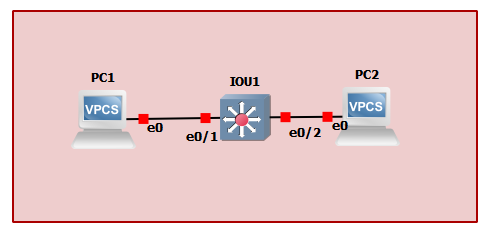
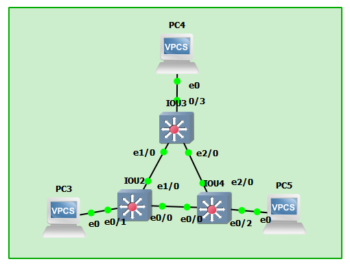

# TP2 : Network low-level, Switching

# Sommaire

- [TP2 : Network low-level, Switching](#tp2--network-low-level-switching)
- [Sommaire](#sommaire)
- [I. Simplest setup](#i-simplest-setup)
      - [Topologie](#topologie)
      - [Plan d'adressage](#plan-dadressage)
- [II. More switches](#ii-more-switches)
      - [Topologie](#topologie-1)
      - [Plan d'adressage](#plan-dadressage-1)
      - [Mise en évidence du Spanning Tree Protocol](#mise-en-%c3%a9vidence-du-spanning-tree-protocol)
      - [Reconfigurer STP](#reconfigurer-stp)
      - [🐙 STP & Perfs](#%f0%9f%90%99-stp--perfs)
- [III. Isolation](#iii-isolation)
  - [1. Simple](#1-simple)
      - [Topologie](#topologie-2)
      - [Plan d'adressage](#plan-dadressage-2)
      - [ToDo](#todo)
  - [2. Avec trunk](#2-avec-trunk)
      - [Topologie](#topologie-3)
      - [Plan d'adressage](#plan-dadressage-3)
      - [ToDo](#todo-1)
- [IV. Need perfs](#iv-need-perfs)
      - [Topologie](#topologie-4)
      - [Plan d'adressage](#plan-dadressage-4)
      - [ToDo](#todo-2)

**Dans ce TP, vous pouvez considérez que :**
* les `PC` sont [**des VPCS de GNS3**](/memo/setup-gns3.md#utilisation-dun-vpcs) (sauf indication contraire)
* les `SW` sont des Switches Cisco, virtualisé avec l'IOU L2

# I. Simplest setup

#### Topologie

```
+-----+        +-------+        +-----+
| PC1 +--------+  IOU1 +--------+ PC2 |
+-----+        +-------+        +-----+
```


#### Plan d'adressage

Machine | `net1`
--- | ---
`PC1` | `10.2.1.1/24`
`PC2` | `10.2.1.2/24`

Depuis PC1 : `ping 10.2.1.2`. Le protocole utilisé est ICMP, mais le protocole ARP est utilisé pour trouver la MAC correspondant à l'adresse IP 10.2.1.2.

Dans le fichier [pc1-iou](captures/pc1-iou.pcapng), les lignes 19-20-21 correspondent aux échanges ARP (broadcast pour "Qui est 10.2.1.2", réponse avec la mac de 10.2.1.2). On voit bien ensuite les request/reply du ping. (de même pour le fichier [pc2-iou](captures/pc2-iou)).

Sur PC1 :
```
show arp
00:50:79:66:68:01  10.2.1.2 expires in 117 seconds
```

Sur PC2 :
```
show arp
00:50:79:66:68:00  10.2.1.1 expires in 65 seconds
```

Le switch n'a pas besoin d'IP car il se comporte comme une "multiprise".

# II. More switches

#### Topologie

```
                        +-----+
                        | PC4 |
                        +--+--+
                           |
                           |
                       +---+---+
                   +---+  IOU3 +----+
                   |   +-------+    |
                   |                |
                   |                |
+-----+        +---+---+        +---+---+        +-----+
| PC3 +--------+  IOU2 +--------+ IOU4  +--------+ PC5 |
+-----+        +-------+        +-------+        +-----+
```


#### Plan d'adressage

Machine | `net1`
--- | ---
`PC3` | `10.2.2.1/24`
`PC4` | `10.2.2.2/24`
`PC5` | `10.2.2.3/24`

Sur PC3 :
```
show
NAME   IP/MASK              GATEWAY           MAC                LPORT  RHOST:PORT
PC3    10.2.2.1/24          255.255.255.0     00:50:79:66:68:04  10016  127.0.0.1:10017
       fe80::250:79ff:fe66:6804/64
PC3> ping 10.2.2.2
84 bytes from 10.2.2.2 icmp_seq=1 ttl=64 time=0.307 ms
84 bytes from 10.2.2.2 icmp_seq=2 ttl=64 time=0.866 ms
^C
PC3> ping 10.2.2.3
84 bytes from 10.2.2.3 icmp_seq=1 ttl=64 time=0.317 ms
84 bytes from 10.2.2.3 icmp_seq=2 ttl=64 time=0.980 ms
^C
```
Sur SW2 :
```
show mac address-table
          Mac Address Table
-------------------------------------------

Vlan    Mac Address       Type        Ports
----    -----------       --------    -----
   1    0050.7966.6804    DYNAMIC     Et1/0 #MAC de PC3 00:50:79:66:68:04
   1    aabb.cc00.0201    DYNAMIC     Et1/0 #MAC de IOU2 sur le port et1/0
   1    aabb.cc00.0400    DYNAMIC     Et1/0 #MAC du IOU4 sur le port et0/0
   1    aabb.cc00.0402    DYNAMIC     Et2/0 #MAC du IOU4 sur le port et2/0
Total Mac Addresses for this criterion: 4
```

Sur les switches : `show interfaces <interface>` pour avoir toutes les infos (dont la mac). La table comprend une adresse MAC par lien (IOU2<->IOU3, IOU4<->IOU3 et IOU2<->IOU4), et la MAC du PC3 qui a effectué un ping. Les VLAN sont par défaut 1.

Pour les trames CDP : [capture CDP iou2-3](captures/iou2-iou3.pcapng), [capture CDP iou2-4](captures/iou2-iou4.pcapng), [capture CDP iou3-4](captures/iou3-iou4.pcapng). Ces trames utilisent Cisco Discovery Protocol, qui sert à la découverte réseau de niveau 2. Il permet de trouver des périphériques voisins connectés.

#### Mise en évidence du Spanning Tree Protocol

Si on considère les trois liens qui unissent les switches :
* `IOU2` <> `IOU3`
* `IOU3` <> `IOU4`
* `IOU2` <> `IOU4`  

**L'un de ces liens a forcément été désactivé.**

Sur IOU2 : (on peut voir qu'il est le *Root bridge* du VLAN1)
```
show spanning-tree summary
Switch is in rapid-pvst mode
Root bridge for: VLAN0001
Extended system ID                      is enabled
Portfast Default                        is disabled
Portfast Edge BPDU Guard Default        is disabled
Portfast Edge BPDU Filter Default       is disabled
Loopguard Default                       is disabled
PVST Simulation Default                 is enabled but inactive in rapid-pvst mode
Bridge Assurance                        is enabled
EtherChannel misconfig guard            is enabled
Configured Pathcost method used is short
UplinkFast                              is disabled
BackboneFast                            is disabled

Name                   Blocking Listening Learning Forwarding STP Active
---------------------- -------- --------- -------- ---------- ----------
VLAN0001                     0         0        0         16         16
---------------------- -------- --------- -------- ---------- ----------
1 vlan                       0         0        0         16         16

show spanning-tree bridge

                                                   Hello  Max  Fwd
Vlan                         Bridge ID              Time  Age  Dly  Protocol
---------------- --------------------------------- -----  ---  ---  --------
VLAN0001         32769 (32768,   1) aabb.cc00.0200    2    20   15  rstp
```
Alors que sur IOU4 :
```
show spanning-tree summary
Switch is in rapid-pvst mode
Root bridge for: none
Extended system ID                      is enabled
Portfast Default                        is disabled
Portfast Edge BPDU Guard Default        is disabled
Portfast Edge BPDU Filter Default       is disabled
Loopguard Default                       is disabled
PVST Simulation Default                 is enabled but inactive in rapid-pvst mode
Bridge Assurance                        is enabled
EtherChannel misconfig guard            is enabled
Configured Pathcost method used is short
UplinkFast                              is disabled
BackboneFast                            is disabled

Name                   Blocking Listening Learning Forwarding STP Active
---------------------- -------- --------- -------- ---------- ----------
VLAN0001                     1         0        0         15         16
---------------------- -------- --------- -------- ---------- ----------
1 vlan                       1         0        0         15         16

show spanning-tree bridge

                                                   Hello  Max  Fwd
Vlan                         Bridge ID              Time  Age  Dly  Protocol
---------------- --------------------------------- -----  ---  ---  --------
VLAN0001         32769 (32768,   1) aabb.cc00.0400    2    20   15  rstp
```
Et sur IOU3 :
```
show spanning-tree summary
Switch is in rapid-pvst mode
Root bridge for: none
Extended system ID                      is enabled
Portfast Default                        is disabled
Portfast Edge BPDU Guard Default        is disabled
Portfast Edge BPDU Filter Default       is disabled
Loopguard Default                       is disabled
PVST Simulation Default                 is enabled but inactive in rapid-pvst mode
Bridge Assurance                        is enabled
EtherChannel misconfig guard            is enabled
Configured Pathcost method used is short
UplinkFast                              is disabled
BackboneFast                            is disabled

Name                   Blocking Listening Learning Forwarding STP Active
---------------------- -------- --------- -------- ---------- ----------
VLAN0001                     0         0        0         16         16
---------------------- -------- --------- -------- ---------- ----------
1 vlan                       0         0        0         16         16

show spanning-tree bridge

                                                   Hello  Max  Fwd
Vlan                         Bridge ID              Time  Age  Dly  Protocol
---------------- --------------------------------- -----  ---  ---  --------
VLAN0001         32769 (32768,   1) aabb.cc00.0300    2    20   15  rstp
```

Les *route port* :
* IOU2 : mac `aabb.cc00.0200`, port `eth0/0`
* IOU3 : mac `aabb.cc00.0300`, port `eth0/0`
* IOU4 : mac `aabb.cc00.0400`, port `eth0/0`

(Voir le schéma)[#Topologie]

* 🌞 confirmer les informations STP
  * effectuer un `ping` d'une machine à une autre
  * vérifier que les trames passent bien par le chemin attendu (Wireshark)
* 🌞 ainsi, déterminer quel lien a été désactivé par STP
* 🌞 faire un schéma qui explique le trajet d'une requête ARP lorsque PC1 ping PC3, et de sa réponse
  * représenter **TOUTES** les trames ARP (n'oubliez pas les broadcasts)

#### Reconfigurer STP

* 🌞 changer la priorité d'un switch qui n'est pas le *root bridge*
* 🌞 vérifier les changements
  * avec des commandes sur les switches
  * 🐙 capturer les échanges qui suivent une reconfiguration STP avec Wireshark

#### 🐙 STP & Perfs

Si vous avez lancé Wireshark sur un lien entre un PC et un Switch, vous avez vu qu'il y a toujours des trames STP qui circulent...
* un peu con non ? C'est un PC, il enverra jamais de trames STP
* aussi avec STP, quand on branche un PC, le lien mettra plusieurs secondes avant de passer en *forwarding* et ainsi transmettre de la donnée
* l'idéal ça serait de désactiver l'envoi de trames STP sur l'interface du switch (ça évite de cramer de la bande passante et du calcul CPU pour rien, générer du trafic inutile, etc.)
* sauuuuf que si un p'tit malin branche des switches là-dessus, il pourrait tout péter en créant une boucle
* deux fonctionnalités à mettre en place : 
  * `portfast` : marque un port comme *"edge"* dans la topologie STP. Un port *edge* est considéré comme une extrémité de la topologie (= un client branché dessus, port *access*). *Port**fast*** parce que ça va permettre au port de s'allumer plus rapidement (sans passer par les états *listening* et *learning* pendant 15 secondes chacun par défaut) et d'être disponible instantanément
    * on peut voir l'état d'un port (forward, listening, learning, blocking avec `show spanning-tree vlan 1`)
  * `bpduguard` : permet de shutdown le port s'il reçoit des *BPDU* (pour rappel : un *BPDU* c'est un message STP)  
  
Idem pour les trames CDP !

🐙 ToDo :
  * [activer ces fonctionnalités (*portfast* et *bpduguard*) et activer le filtre BPDU](/memo/cli-cisco.md#stp) sur les interfaces où c'est nécessaire (marqué comme *edge* dans la topologie STP)
  * aussi [désactiver l'envoi de trames CDP](/memo/cli-cisco.md#cdp) sur ces ports
    * prouver avec Wireshark que le switch n'envoie plus de BPDU ni de trames CDP
    * faites une capture avant et une capture après les manips pour le prouver :)

# III. Isolation

## 1. Simple
 
#### Topologie
```
+-----+        +-------+        +-----+
| PC1 +--------+  SW1  +--------+ PC3 |
+-----+      10+-------+20      +-----+
                 20|
                   |
                +--+--+
                | PC2 |
                +-----+
```

#### Plan d'adressage

Machine | IP `net1` | VLAN
--- | --- | --- 
`PC1` | `10.2.3.1/24` | 10
`PC2` | `10.2.3.2/24` | 20
`PC3` | `10.2.3.3/24` | 20

#### ToDo

* 🌞 mettre en place la topologie ci-dessus
  * voir [les commandes dédiées à la manipulation de VLANs](/memo/cli-cisco.md#vlan)
* 🌞 faire communiquer les PCs deux à deux
  * vérifier que `PC2` ne peut joindre que `PC3`
  * vérifier que `PC1` ne peut joindre personne alors qu'il est dans le même réseau (sad)

## 2. Avec trunk

#### Topologie

```
+-----+        +-------+        +-------+        +-----+
| PC1 +--------+  SW1  +--------+  SW2  +--------+ PC4 |
+-----+      10+-------+        +-------+20      +-----+
                 20|              10|
                   |                |
                +--+--+          +--+--+
                | PC2 |          | PC3 |
                +-----+          +-----+
```

#### Plan d'adressage

Machine | IP `net1` | IP `net2` | VLAN
--- | --- | --- | ---
`PC1` | `10.2.10.1/24` | X | 10
`PC2` | X | `10.2.20.1/24` | 20
`PC3` | `10.2.10.2/24` | X | 10
`PC4` | X | `10.2.20.2/24` | 20

#### ToDo

* 🌞 mettre en place la topologie ci-dessus
* 🌞 faire communiquer les PCs deux à deux
  * vérifier que `PC1` ne peut joindre que `PC3`
  * vérifier que `PC4` ne peut joindre que `PC2`
* 🌞 mettre en évidence l'utilisation des VLANs avec Wireshark

# IV. Need perfs

#### Topologie

Pareil qu'en [III.2.](#2-avec-trunk) à part le lien entre SW1 et SW2 qui est doublé.

```
+-----+        +-------+--------+-------+        +-----+
| PC1 +--------+  SW1  |        |  SW2  +--------+ PC4 |
+-----+      10+-------+--------+-------+20      +-----+
                 20|              10|
                   |                |
                +--+--+          +--+--+
                | PC2 |          | PC3 |
                +-----+          +-----+

```
#### Plan d'adressage

Pareil qu'en [III.2.](#2-avec-trunk).

Machine | IP `net1` | IP `net2` | VLAN
--- | --- | --- | ---
`PC1` | `10.2.10.1/24` | X | 10
`PC2` | X | `10.2.20.1/24` | 20
`PC3` | `10.2.10.2/24` | X | 10
`PC4` | X | `10.2.20.2/24` | 20

#### ToDo

* 🌞 mettre en place la topologie ci-dessus
  * configurer LACP entre `SW1` et `SW2`
  * utiliser Wireshark pour mettre en évidence l'utilisation de trames LACP
  * **vérifier avec un `show ip interface po1` que la bande passante a bien été doublée**

> Pas de failover possible sur les IOUs malheureusement :( (voir [ce doc](https://www.cisco.com/c/en/us/td/docs/switches/blades/3020/software/release/12-2_58_se/configuration/guide/3020_scg/swethchl.pdf), dernière section. Pas de link state dans les IOUs)
