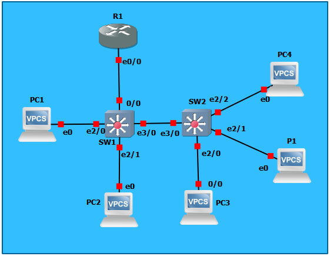

# TP3 : Routage INTER-VLAN + mise en situation

# Sommaire

- [TP3 : Routage INTER-VLAN + mise en situation](#tp3--routage-inter-vlan--mise-en-situation)
- [Sommaire](#sommaire)
- [I. *Router-on-a-stick*](#i-router-on-a-stick)
- [II. Cas concret](#ii-cas-concret)

**Dans ce TP, vous pouvez considérez que :**
* les `PC` sont [des VPCS de GNS3](/memo/setup-gns3.md#utilisation-dun-vpcs) (sauf indication contraire)
* les `P` sont des imprimantes, on les simulera avec des VPCS aussi
* les `SRV` sont ds serveurs, VPCS again
* les `SW` sont des Switches Cisco, virtualisé avec [l'IOU L2](/memo/setup-gns3.md#get-and-setup-iou)
* les `R` sont des routeurs, virtualisé avec l'iOS dispo ici : [Cisco 3640](https://drive.google.com/drive/folders/1DFe2u5tZldL_y_UYm32ZbmT0cIfgQM2p)

# I. *Router-on-a-stick*

```
             +--+
             |R1|
             +-++
               |
               |                    +---+
               |          +---------+PC4|
+---+        +-+-+      +---+       +---+
|PC1+--------+SW1+------+SW2|
+---+        +-+-+      +-+--+
               |          |  |
               |          |  +------+--+
               |          |         |P1|
             +-+-+      +-+-+       +--+
             |PC2|      |PC3|
             +---+      +---+
```


**Tableau des réseaux utilisés**

Réseau | Adresse | VLAN | Description
--- | --- | --- | ---
`net1` | `10.3.10.0/24` | 10 | Utilisateurs
`net2` | `10.3.20.0/24` | 20 | Admins
`net3` | `10.3.30.0/24` | 30 | Visiteurs
`netP` | `10.3.40.0/24` | 40 | Imprimantes

**Qui peut joindre qui ?**

✅ = peuvent se joindre
❌ = ne peuvent pas se joindre

Réseaux | `net1` |  `net2` |  `net3` |  `netP`
--- | --- | --- | --- | ---
 `net1` | ✅ | ❌ | ❌ | ✅
 `net2` | ❌ | ✅ | ❌ | ✅
 `net3` | ❌ | ❌ | ✅ | ✅
 `netP` | ✅ | ✅ | ✅ | ✅

**Tableau d'adressage**

Machine | VLAN | IP `net1` | IP `net2` | IP `net3` |  IP `netP`
--- | --- | --- | --- | --- | ---
PC1 | 10 | `10.3.10.1/24` | x | x | x
PC2 | 20 | x | `10.3.20.2/24` | x | x | x
PC3 | 30 | x | `10.3.20.3/24` | x | x | x
PC4 | 30 | x | x |  `10.3.30.4/24` | x | x
P1 | 40 | x | x | x | `10.3.40.1/24` 
R1 | x |  `10.3.10.254/24` | `10.3.20.254/24` | `10.3.30.254/24` | `10.3.40.254/24` 

SW1 :
```
SW1#conf t
Enter configuration commands, one per line.  End with CNTL/Z.
SW1(config)#vlan 10
SW1(config-vlan)#name users
SW1(config-vlan)#exit
SW1(config)#vlan 20
SW1(config-vlan)#name admins
SW1(config-vlan)#exi
SW1(config)#vlan 30
SW1(config-vlan)#name visitors
SW1(config-vlan)#exit
SW1(config)#vlan 40
SW1(config-vlan)#name printers
SW1(config-vlan)#exit
SW1(config)#interface et 2/0
SW1(config-if)#switchport mode access
SW1(config-if)#switchport access vlan 10
SW1(config-if)#exit
SW1(config)#interface et 2/1
SW1(config-if)#switchport mode access
SW1(config-if)#switchport access vlan 20
SW1(config-if)#exit
SW1(config)#interface et 3/0
SW1(config-if)#switchport trunk encapsulation dot1q
SW1(config-if)#switchport mode trunk
SW1(config-if)#switchport trunk allowed vlan 10,20,30,40
SW1(config-if)#exit
SW1(config)#interface et 0/0
SW1(config-if)#switchport trunk encapsulation dot1q
SW1(config-if)#switchport mode trunk
SW1(config-if)#switchport trunk allowed vlan 10,20,30,40
SW1(config-if)#exit
SW1(config)#exit
wr
```

SW2 :
```
SW2#conf t
Enter configuration commands, one per line.  End with CNTL/Z.
SW2(config)#vlan 10
SW2(config-vlan)#name users
SW2(config-vlan)#exit
SW2(config)#vlan 20
SW2(config-vlan)#name admins
SW2(config-vlan)#exit
SW2(config)#vlan 3
SW2(config-vlan)#exit
SW2(config)#vlan 30
SW2(config-vlan)#name visitors
SW2(config-vlan)#exit
SW2(config)#vlan 40
SW2(config-vlan)#name printers
SW2(config-vlan)#exit
SW2(config)#interface et 2/0
SW2(config-if)#switchport mode access
SW2(config-if)#switchport access vlan 20
SW2(config-if)#exit
SW2(config)#interface et 2/1
SW2(config-if)#switchport mode access
SW2(config-if)#switchport access vlan 40
SW2(config-if)#exit
SW2(config)#interface et 2/2
SW2(config-if)#switchport mode access
SW2(config-if)#switchport access vlan 30
SW2(config-if)#exit
SW2(config)#interface et 3/0
SW2(config-if)#switchport trunk encapsulation dot1q
SW2(config-if)#switchport mode trunk
SW2(config-if)#switchport trunk allowed vlan 10,20,30,40
SW2(config-if)#exit
SW2(config)#exit
wr
```
R1 :
```
R1#conf t
Enter configuration commands, one per line.  End with CNTL/Z.
R1(config)#interface et 0/0.10
R1(config-subif)#encapsulation dot1q 10
R1(config-subif)#ip address 10.3.10.254 255.255.255.0
R1(config-subif)#exit
R1(config)#interface et 0/0.20
R1(config-subif)#encapsulation dot1q 20
R1(config-subif)#ip address 10.3.20.254 255.255.255.0
R1(config-subif)#exit
R1(config)#interface et 0/0.30
R1(config-subif)#encapsulation dot1q 30
R1(config-subif)#ip address 10.3.30.254 255.255.255.0
R1(config-subif)#exit
R1(config)#interface et 0/0.40
R1(config-subif)#encapsulation dot1q 40
R1(config-subif)#ip address 10.3.40.254 255.255.255.0
R1(config-subif)#exit
R1(config)#interface et 0/0
R1(config-if)#no shut
R1(config-if)#exit
R1(config)#exit
wr
```
Vérifications :
```
PC1> show ip

NAME        : PC1[1]
IP/MASK     : 10.3.10.1/24
GATEWAY     : 255.255.255.0
DNS         :
MAC         : 00:50:79:66:68:00
LPORT       : 10020
RHOST:PORT  : 127.0.0.1:10021
MTU:        : 1500

PC1> ping 10.3.20.2
host (255.255.255.0) not reachable

PC1> ping 10.3.20.3
host (255.255.255.0) not reachable

PC1> ping 10.3.30.4
host (255.255.255.0) not reachable

PC1> ping 10.3.40.1
host (255.255.255.0) not reachable

PC1> ping 10.3.10.254
84 bytes from 10.3.10.254 icmp_seq=1 ttl=255 time=9.304 ms
84 bytes from 10.3.10.254 icmp_seq=2 ttl=255 time=5.612 ms
84 bytes from 10.3.10.254 icmp_seq=3 ttl=255 time=1.894 ms
84 bytes from 10.3.10.254 icmp_seq=4 ttl=255 time=0.971 ms
84 bytes from 10.3.10.254 icmp_seq=5 ttl=255 time=9.059 ms


PC2> show ip

NAME        : PC2[1]
IP/MASK     : 10.3.20.2/24
GATEWAY     : 255.255.255.0
DNS         :
MAC         : 00:50:79:66:68:01
LPORT       : 10022
RHOST:PORT  : 127.0.0.1:10023
MTU:        : 1500

PC2> ping 10.3.10.1
host (255.255.255.0) not reachable

PC2> ping 10.3.20.3
84 bytes from 10.3.20.3 icmp_seq=1 ttl=64 time=0.304 ms
84 bytes from 10.3.20.3 icmp_seq=2 ttl=64 time=0.426 ms
84 bytes from 10.3.20.3 icmp_seq=3 ttl=64 time=0.608 ms
84 bytes from 10.3.20.3 icmp_seq=4 ttl=64 time=0.763 ms
84 bytes from 10.3.20.3 icmp_seq=5 ttl=64 time=0.519 ms

PC2> ping 10.3.30.4
host (255.255.255.0) not reachable

PC2> ping 10.3.40.1
host (255.255.255.0) not reachable

PC2> ping 10.3.20.254
84 bytes from 10.3.20.254 icmp_seq=1 ttl=255 time=9.708 ms
84 bytes from 10.3.20.254 icmp_seq=2 ttl=255 time=6.440 ms
84 bytes from 10.3.20.254 icmp_seq=3 ttl=255 time=5.919 ms
84 bytes from 10.3.20.254 icmp_seq=4 ttl=255 time=5.602 ms
84 bytes from 10.3.20.254 icmp_seq=5 ttl=255 time=5.966 ms


PC3> show ip

NAME        : PC3[1]
IP/MASK     : 10.3.20.3/24
GATEWAY     : 255.255.255.0
DNS         :
MAC         : 00:50:79:66:68:02
LPORT       : 10024
RHOST:PORT  : 127.0.0.1:10025
MTU:        : 1500

PC3> ping 10.3.10.1
host (255.255.255.0) not reachable

PC3> ping 10.3.20.2
84 bytes from 10.3.20.2 icmp_seq=1 ttl=64 time=0.518 ms
84 bytes from 10.3.20.2 icmp_seq=2 ttl=64 time=0.688 ms
84 bytes from 10.3.20.2 icmp_seq=3 ttl=64 time=0.476 ms
84 bytes from 10.3.20.2 icmp_seq=4 ttl=64 time=0.512 ms
84 bytes from 10.3.20.2 icmp_seq=5 ttl=64 time=0.643 ms

PC3> ping 10.3.30.4
host (255.255.255.0) not reachable

PC3> ping 10.3.40.1
host (255.255.255.0) not reachable

PC3> ping 10.3.20.254
84 bytes from 10.3.20.254 icmp_seq=1 ttl=255 time=9.742 ms
84 bytes from 10.3.20.254 icmp_seq=2 ttl=255 time=8.421 ms
84 bytes from 10.3.20.254 icmp_seq=3 ttl=255 time=7.162 ms
84 bytes from 10.3.20.254 icmp_seq=4 ttl=255 time=6.468 ms
84 bytes from 10.3.20.254 icmp_seq=5 ttl=255 time=6.025 ms

PC3> ping 10.3.10.254
host (255.255.255.0) not reachable


PC4> show ip

NAME        : PC4[1]
IP/MASK     : 10.3.30.4/24
GATEWAY     : 255.255.255.0
DNS         :
MAC         : 00:50:79:66:68:03
LPORT       : 10026
RHOST:PORT  : 127.0.0.1:10027
MTU:        : 1500

PC4> ping 10.3.10.1
host (255.255.255.0) not reachable

PC4> ping 10.3.20.2
host (255.255.255.0) not reachable

PC4> ping 10.3.20.3
host (255.255.255.0) not reachable

PC4> ping 10.3.40.1
host (255.255.255.0) not reachable

PC4> ping 10.3.30.254
84 bytes from 10.3.30.254 icmp_seq=1 ttl=255 time=9.628 ms
84 bytes from 10.3.30.254 icmp_seq=2 ttl=255 time=7.323 ms
84 bytes from 10.3.30.254 icmp_seq=3 ttl=255 time=7.714 ms
84 bytes from 10.3.30.254 icmp_seq=4 ttl=255 time=7.262 ms
84 bytes from 10.3.30.254 icmp_seq=5 ttl=255 time=6.442 ms


P1> show ip

NAME        : P1[1]
IP/MASK     : 10.3.40.1/24
GATEWAY     : 255.255.255.0
DNS         :
MAC         : 00:50:79:66:68:04
LPORT       : 10028
RHOST:PORT  : 127.0.0.1:10029
MTU:        : 1500

P1> ping 10.3.10.1
host (255.255.255.0) not reachable

P1> ping 10.3.20.2
host (255.255.255.0) not reachable

P1> ping 10.3.20.3
host (255.255.255.0) not reachable

P1> ping 10.3.30.4
host (255.255.255.0) not reachable

P1> ping 10.3.40.254
84 bytes from 10.3.40.254 icmp_seq=1 ttl=255 time=9.065 ms
84 bytes from 10.3.40.254 icmp_seq=2 ttl=255 time=6.102 ms
84 bytes from 10.3.40.254 icmp_seq=3 ttl=255 time=5.895 ms
84 bytes from 10.3.40.254 icmp_seq=4 ttl=255 time=6.177 ms
84 bytes from 10.3.40.254 icmp_seq=5 ttl=255 time=5.570 ms
```
> (c'est bon j'ai compris pour le router, déso Leo je te rapporterai un gâteau si tu lis ça (ou une bière c'est sympa les bières))

# II. Cas concret

**Qui a accès à qui exactement ?**

✅ = peuvent se joindre
❌ = ne peuvent pas se joindre

X | Admins | Users | Stagiaires | Serveurs | SS | Imprimantes
--- | --- | --- | --- | --- | --- | --- | 
Admins | ✅ | ❌ | ❌ | ✅ | ✅ | ✅ |
Users | ❌ | ✅ | ❌ | ✅ | ❌ | ✅ |
Stagiaires | ❌ | ❌ | ✅ | ❌ | ❌ | ✅ |
Serveurs | ✅ | ✅ | ❌ | ✅ | ❌ | ✅ |
Serveurs sensibles | ✅ | ❌ | ❌ | ❌ | ✅ | ❌ |
Imprimantes | ✅ | ✅ | ✅ | ✅ | ❌ | ✅ |

---

**Bonus**
* 🐙 mettre en place les exceptions
  * documentez-vous, proposez des choses
* 🐙 mettre en place un serveur DHCP 
  * il devra 
    * s'intégrer à l'existant
    * être installé sur une VM dédiée (Virtualbox, Workstation)
    * permettre l'attribution d'IPs pour tous les PCs clients (admins, users, stagiaires)
    * libre choix de l'OS (m'enfin, déconnez pas, on va pas mettre un Windows Server 2016 si ?...)
  * mise en place d'un test avec l'ajout d'un nouveau client
