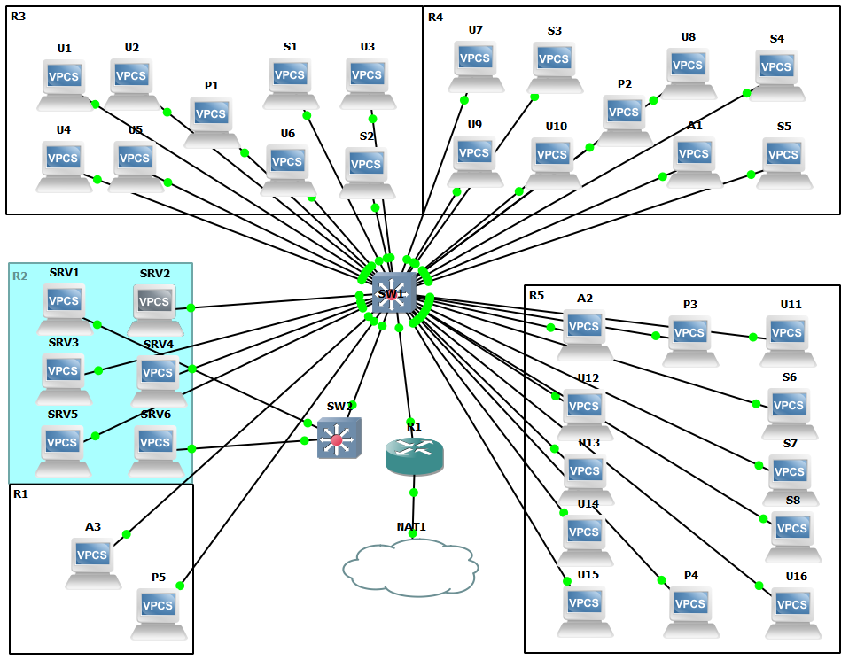

# TP3 : Routage INTER-VLAN + mise en situation

# Sommaire

- [TP3 : Routage INTER-VLAN + mise en situation](#tp3--routage-inter-vlan--mise-en-situation)
- [Sommaire](#sommaire)
- [I. *Router-on-a-stick*](#i-router-on-a-stick)
- [II. Cas concret](#ii-cas-concret)

**Dans ce TP, vous pouvez considérez que :**
* les `PC` sont [des VPCS de GNS3](/memo/setup-gns3.md#utilisation-dun-vpcs) (sauf indication contraire)
* les `P` sont des imprimantes, on les simulera avec des VPCS aussi
* les `SRV` sont ds serveurs, VPCS again
* les `SW` sont des Switches Cisco, virtualisé avec [l'IOU L2](/memo/setup-gns3.md#get-and-setup-iou)
* les `R` sont des routeurs, virtualisé avec l'iOS dispo ici : [Cisco 3640](https://drive.google.com/drive/folders/1DFe2u5tZldL_y_UYm32ZbmT0cIfgQM2p)

# I. *Router-on-a-stick*

```
             +--+
             |R1|
             +-++
               |
               |                    +---+
               |          +---------+PC4|
+---+        +-+-+      +---+       +---+
|PC1+--------+SW1+------+SW2|
+---+        +-+-+      +-+--+
               |          |  |
               |          |  +------+--+
               |          |         |P1|
             +-+-+      +-+-+       +--+
             |PC2|      |PC3|
             +---+      +---+
```


**Tableau des réseaux utilisés**

Réseau | Adresse | VLAN | Description
--- | --- | --- | ---
`net1` | `10.3.10.0/24` | 10 | Utilisateurs
`net2` | `10.3.20.0/24` | 20 | Admins
`net3` | `10.3.30.0/24` | 30 | Visiteurs
`netP` | `10.3.40.0/24` | 40 | Imprimantes

**Qui peut joindre qui ?**

✅ = peuvent se joindre
❌ = ne peuvent pas se joindre

Réseaux | `net1` |  `net2` |  `net3` |  `netP`
--- | --- | --- | --- | ---
 `net1` | ✅ | ❌ | ❌ | ✅
 `net2` | ❌ | ✅ | ❌ | ✅
 `net3` | ❌ | ❌ | ✅ | ✅
 `netP` | ✅ | ✅ | ✅ | ✅

**Tableau d'adressage**

Machine | VLAN | IP `net1` | IP `net2` | IP `net3` |  IP `netP`
--- | --- | --- | --- | --- | ---
PC1 | 10 | `10.3.10.1/24` | x | x | x
PC2 | 20 | x | `10.3.20.2/24` | x | x | x
PC3 | 30 | x | `10.3.20.3/24` | x | x | x
PC4 | 30 | x | x |  `10.3.30.4/24` | x | x
P1 | 40 | x | x | x | `10.3.40.1/24` 
R1 | x |  `10.3.10.254/24` | `10.3.20.254/24` | `10.3.30.254/24` | `10.3.40.254/24` 

SW1 :
```
SW1#conf t
Enter configuration commands, one per line.  End with CNTL/Z.
SW1(config)#vlan 10
SW1(config-vlan)#name users
SW1(config-vlan)#exit
SW1(config)#vlan 20
SW1(config-vlan)#name admins
SW1(config-vlan)#exi
SW1(config)#vlan 30
SW1(config-vlan)#name visitors
SW1(config-vlan)#exit
SW1(config)#vlan 40
SW1(config-vlan)#name printers
SW1(config-vlan)#exit
SW1(config)#interface et 2/0
SW1(config-if)#switchport mode access
SW1(config-if)#switchport access vlan 10
SW1(config-if)#exit
SW1(config)#interface et 2/1
SW1(config-if)#switchport mode access
SW1(config-if)#switchport access vlan 20
SW1(config-if)#exit
SW1(config)#interface et 3/0
SW1(config-if)#switchport trunk encapsulation dot1q
SW1(config-if)#switchport mode trunk
SW1(config-if)#switchport trunk allowed vlan 10,20,30,40
SW1(config-if)#exit
SW1(config)#interface et 0/0
SW1(config-if)#switchport trunk encapsulation dot1q
SW1(config-if)#switchport mode trunk
SW1(config-if)#switchport trunk allowed vlan 10,20,30,40
SW1(config-if)#exit
SW1(config)#exit
wr
```

SW2 :
```
SW2#conf t
Enter configuration commands, one per line.  End with CNTL/Z.
SW2(config)#vlan 10
SW2(config-vlan)#name users
SW2(config-vlan)#exit
SW2(config)#vlan 20
SW2(config-vlan)#name admins
SW2(config-vlan)#exit
SW2(config)#vlan 3
SW2(config-vlan)#exit
SW2(config)#vlan 30
SW2(config-vlan)#name visitors
SW2(config-vlan)#exit
SW2(config)#vlan 40
SW2(config-vlan)#name printers
SW2(config-vlan)#exit
SW2(config)#interface et 2/0
SW2(config-if)#switchport mode access
SW2(config-if)#switchport access vlan 20
SW2(config-if)#exit
SW2(config)#interface et 2/1
SW2(config-if)#switchport mode access
SW2(config-if)#switchport access vlan 40
SW2(config-if)#exit
SW2(config)#interface et 2/2
SW2(config-if)#switchport mode access
SW2(config-if)#switchport access vlan 30
SW2(config-if)#exit
SW2(config)#interface et 3/0
SW2(config-if)#switchport trunk encapsulation dot1q
SW2(config-if)#switchport mode trunk
SW2(config-if)#switchport trunk allowed vlan 10,20,30,40
SW2(config-if)#exit
SW2(config)#exit
wr
```
R1 :
```
R1#conf t
Enter configuration commands, one per line.  End with CNTL/Z.
R1(config)#interface et 0/0.10
R1(config-subif)#encapsulation dot1q 10
R1(config-subif)#ip address 10.3.10.254 255.255.255.0
R1(config-subif)#exit
R1(config)#interface et 0/0.20
R1(config-subif)#encapsulation dot1q 20
R1(config-subif)#ip address 10.3.20.254 255.255.255.0
R1(config-subif)#exit
R1(config)#interface et 0/0.30
R1(config-subif)#encapsulation dot1q 30
R1(config-subif)#ip address 10.3.30.254 255.255.255.0
R1(config-subif)#exit
R1(config)#interface et 0/0.40
R1(config-subif)#encapsulation dot1q 40
R1(config-subif)#ip address 10.3.40.254 255.255.255.0
R1(config-subif)#exit
R1(config)#interface et 0/0
R1(config-if)#no shut
R1(config-if)#exit
R1(config)#exit
wr
```
Vérifications :
```
# (sur PC2, PC3, PC4 et P1 on met les gateway avec la commande ip <addr> <gateway>)


PC2> show ip

NAME        : PC2[1]
IP/MASK     : 10.3.20.2/24
GATEWAY     : 10.3.20.254
DNS         :
MAC         : 00:50:79:66:68:01
LPORT       : 10022
RHOST:PORT  : 127.0.0.1:10023
MTU:        : 1500

PC2> ping 10.3.30.4
10.3.30.4 icmp_seq=1 timeout
84 bytes from 10.3.30.4 icmp_seq=2 ttl=63 time=11.648 ms
84 bytes from 10.3.30.4 icmp_seq=3 ttl=63 time=16.019 ms
84 bytes from 10.3.30.4 icmp_seq=4 ttl=63 time=10.777 ms
84 bytes from 10.3.30.4 icmp_seq=5 ttl=63 time=16.340 ms

PC2> ping 10.3.10.1
10.3.10.1 icmp_seq=1 timeout
10.3.10.1 icmp_seq=2 timeout
10.3.10.1 icmp_seq=3 timeout
10.3.10.1 icmp_seq=4 timeout
10.3.10.1 icmp_seq=5 timeout


PC3> show ip

NAME        : PC3[1]
IP/MASK     : 10.3.20.3/24
GATEWAY     : 10.3.20.254
DNS         :
MAC         : 00:50:79:66:68:02
LPORT       : 10024
RHOST:PORT  : 127.0.0.1:10025
MTU:        : 1500

PC3> ping 10.3.40.1
84 bytes from 10.3.40.1 icmp_seq=1 ttl=63 time=11.140 ms
84 bytes from 10.3.40.1 icmp_seq=2 ttl=63 time=16.664 ms
84 bytes from 10.3.40.1 icmp_seq=3 ttl=63 time=15.931 ms
84 bytes from 10.3.40.1 icmp_seq=4 ttl=63 time=15.873 ms
84 bytes from 10.3.40.1 icmp_seq=5 ttl=63 time=19.914 ms

PC3> ping 10.3.10.1
10.3.10.1 icmp_seq=1 timeout
10.3.10.1 icmp_seq=2 timeout
10.3.10.1 icmp_seq=3 timeout
10.3.10.1 icmp_seq=4 timeout
10.3.10.1 icmp_seq=5 timeout


PC4> show ip

NAME        : PC4[1]
IP/MASK     : 10.3.30.4/24
GATEWAY     : 255.255.255.0
DNS         :
MAC         : 00:50:79:66:68:03
LPORT       : 10026
RHOST:PORT  : 127.0.0.1:10027
MTU:        : 1500

PC4> ping 10.3.10.1
host (255.255.255.0) not reachable

PC4> ping 10.3.20.2
host (255.255.255.0) not reachable

PC4> ping 10.3.20.3
host (255.255.255.0) not reachable

PC4> ping 10.3.40.1
host (255.255.255.0) not reachable

PC4> ping 10.3.30.254
84 bytes from 10.3.30.254 icmp_seq=1 ttl=255 time=9.628 ms
84 bytes from 10.3.30.254 icmp_seq=2 ttl=255 time=7.323 ms
84 bytes from 10.3.30.254 icmp_seq=3 ttl=255 time=7.714 ms
84 bytes from 10.3.30.254 icmp_seq=4 ttl=255 time=7.262 ms
84 bytes from 10.3.30.254 icmp_seq=5 ttl=255 time=6.442 ms


PC4> show ip

NAME        : PC4[1]
IP/MASK     : 10.3.30.4/24
GATEWAY     : 10.3.30.254
DNS         :
MAC         : 00:50:79:66:68:03
LPORT       : 10022
RHOST:PORT  : 127.0.0.1:10023
MTU:        : 1500

PC4> ping 10.3.40.1
10.3.40.1 icmp_seq=1 timeout
10.3.40.1 icmp_seq=2 timeout
84 bytes from 10.3.40.1 icmp_seq=3 ttl=63 time=19.202 ms
84 bytes from 10.3.40.1 icmp_seq=4 ttl=63 time=12.501 ms
84 bytes from 10.3.40.1 icmp_seq=5 ttl=63 time=19.095 ms

PC4> ping 10.3.10.1
10.3.10.1 icmp_seq=1 timeout
10.3.10.1 icmp_seq=2 timeout
10.3.10.1 icmp_seq=3 timeout

```
> (c'est bon j'ai compris pour le router, déso Leo je te rapporterai un gâteau si tu lis ça (ou une bière c'est sympa les bières))

# II. Cas concret

**Qui a accès à qui exactement ?**

✅ = peuvent se joindre
❌ = ne peuvent pas se joindre

X | Admins | Users | Stagiaires | Serveurs | SS | Imprimantes
--- | --- | --- | --- | --- | --- | --- | 
Admins | ✅ | ❌ | ❌ | ✅ | ✅ | ✅ |
Users | ❌ | ✅ | ❌ | ✅ | ❌ | ✅ |
Stagiaires | ❌ | ❌ | ✅ | ❌ | ❌ | ✅ |
Serveurs | ✅ | ✅ | ❌ | ✅ | ❌ | ✅ |
Serveurs sensibles | ✅ | ❌ | ❌ | ❌ | ✅ | ❌ |
Imprimantes | ✅ | ✅ | ✅ | ✅ | ❌ | ✅ |

Table d'adressage (tous les réseaux sont /24) :

| hostname | net10 | net23 | net24 | net25 | net33 | net34 | net35 | net41 | net43 | net44 | net45 | net50 | net60 |
|:--------:|:-----------:|:-----------:|:-----------:|:-----------:|:-----------:|:-----------:|:-----------:|:-----------:|:-----------:|:-----------:|:-----------:|:-----------:|:-----------:|
| U1 | X | 10.4.23.100 | X | X | X | X | X | X | X | X | X | X | X |
| U2 | X | 10.4.23.101 | X | X | X | X | X | X | X | X | X | X | X |
| U3 | X | 10.4.23.102 | X | X | X | X | X | X | X | X | X | X | X |
| U4 | X | 10.4.23.103 | X | X | X | X | X | X | X | X | X | X | X |
| U5 | X | 10.4.23.104 | X | X | X | X | X | X | X | X | X | X | X |
| U6 | X | 10.4.23.105 | X | X | X | X | X | X | X | X | X | X | X |
| U7 | X | X | 10.4.24.100 | X | X | X | X | X | X | X | X | X | X |
| U8 | X | X | 10.4.24.101 | X | X | X | X | X | X | X | X | X | X |
| U9 | X | X | 10.4.24.102 | X | X | X | X | X | X | X | X | X | X |
| U10 | X | X | 10.4.24.103 | X | X | X | X | X | X | X | X | X | X |
| U11 | X | X | X | 10.4.25.100 | X | X | X | X | X | X | X | X | X |
| U12 | X | X | X | 10.4.25.101 | X | X | X | X | X | X | X | X | X |
| U13 | X | X | X | 10.4.25.102 | X | X | X | X | X | X | X | X | X |
| U14 | X | X | X | 10.4.25.103 | X | X | X | X | X | X | X | X | X |
| U15 | X | X | X | 10.4.25.104 | X | X | X | X | X | X | X | X | X |
| U16 | X | X | X | 10.4.25.105 | X | X | X | X | X | X | X | X | X |
| S1 | X | X | X | X | 10.4.33.100 | X | X | X | X | X | X | X | X |
| S2 | X | X | X | X | 10.4.33.101 | X | X | X | X | X | X | X | X |
| S3 | X | X | X | X | X | 10.4.34.100 | X | X | X | X | X | X | X |
| S4 | X | X | X | X | X | 10.4.34.101 | X | X | X | X | X | X | X |
| S5 | X | X | X | X | X | 10.4.34.102 | X | X | X | X | X | X | X |
| S6 | X | X | X | X | X | X | 10.4.35.100 | X | X | X | X | X | X |
| S7 | X | X | X | X | X | X | 10.4.35.101 | X | X | X | X | X | X |
| S8 | X | X | X | X | X | X | 10.4.35.102 | X | X | X | X | X | X |
| A1 | 10.4.10.100 | X | X | X | X | X | X | X | X | X | X | X | X |
| A2 | 10.4.10.101 | X | X | X | X | X | X | X | X | X | X | X | X |
| A3 | 10.4.10.102 | X | X | X | X | X | X | X | X | X | X | X | X |
| P1 | X | X | X | X | X | X | X | X | 10.4.43.100 | X | X | X | X |
| P2 | X | X | X | X | X | X | X | X | X | 10.4.44.100 | X | X | X |
| P3 | X | X | X | X | X | X | X | X | X | X | 10.4.45.100 | X | X |
| P4 | X | X | X | X | X | X | X | X | X | X | 10.4.45.101 | X | X |
| P5 | X | X | X | X | X | X | X | 10.4.41.100 | X | X | X | X | X |
| SRV1 | X | X | X | X | X | X | X | X | X | X | X | X | 10.4.60.100 |
| SRV2 | X | X | X | X | X | X | X | X | X | X | X | 10.4.50.100 | X |
| SRV3 | X | X | X | X | X | X | X | X | X | X | X | 10.4.50.101 | X |
| SRV4 | X | X | X | X | X | X | X | X | X | X | X | 10.4.50.102 | X |
| SRV5 | X | X | X | X | X | X | X | X | X | X | X | 10.4.50.103 | X |
| SRV6 | X | X | X | X | X | X | X | X | X | X | X | X | 10.4.60.101 |
| R1 | 10.4.10.254 | 10.4.23.254 | 10.4.24.254 | 10.4.25.254 | 10.4.33.254 | 10.4.34.254 | 10.4.35.254 | 10.4.41.254 | 10.4.43.254 | 10.4.44.254 | 10.4.45.254 | 10.4.50.254 | 10.4.60.254 |



Toutes les configurations sont [ici](configurations). Bon courage...

Les réseaux sont tous en /24 (oui on a lu le "dimensionnez intelligemment les réseaux" après avoir fait le tableau d'adressage...), soit 254 machines par sous-réseau. Mais logiquement on pourrait les mettre en place en /26 pour 62 machines voire /27 pour 30 machines (mais c'est juste). On va considérer que cette infra permet une grosse augmentation du nombre de machines. Selon cette infra, il y aurait deux switches et un routeur, idéalement situés dans la salle serveur pour réguler leur accès (logiquement l'accès à la salle serveur est restreint, ce qui permet d'éviter certaines failles de sécurité). En considérant que la salle serveur est située entre 8m et 12m en hauteur (y) et 0m et 5m en largeur (x). On va considérer qu'il y a un rack en 5,8 (x,y) avec les deux switches et le routeur pour plus de facilités. Le switch premier switch doit avoir idéalement au minimum 12 adaptateurs, pour permettre l'ajout de quelques clients, mais au mieux 16 adaptateurs pour avoir assurément la place pour une grosse augmentation. Le deuxième switch n'étant utilisé que pour les serveurs sensibles, il n'a besoin que de 2 adaptateurs (voire plus si on prévoit une augmentation). Le routeur ici quant à lui n'a besoin que de deux ports (un pour le switch, un pour le NAT). Les câbles :
* 4 courts (SRV2 et les liens switchs <> switchs et switchs <> routeur (et NAT))
* 10 moyens (P1, U4, U5, U6, S2 et les autres serveurs)
* 27 longs (le reste)

On a décidé de mettre les serveurs sensibles sur un switch différent et dans un vlan à part pour être sûr qu'il n'y ait pas de faille de sécurité. Tous les autres serveurs et clients sont sur le même switch pour économiser. Grâce au vlan, on peut mettre en place certaines communications simples internes au réseau, cependant les clients ne communiquent pas entre eux d'une salle à l'autre, et les différents vlans ne peuvent pas communiquer entre eux non plus. Pour pouvoir résoudre ces problèmes, on met en place le routeur avec des sous-interfaces et de l'encapsulation dot1q. On met également en place des ACL (access-list) qui permettent de définir des règles de communication entre réseaux. Le routeur a également une interface NAT, avec une IP attribuée en DHCP. Grâce aux ACL, on peut définir que les stagiaires ne communiquent qu'entre eux par exemple, ou que les clients n'ont accès qu'aux imprimantes de leur salle, ou encore permettre ou non l'accès à internet (ici les imprimantes et les serveurs sensibles n'ont pas d'accès internet). Toutes les ACL mises en place fonctionnent pour n'importe quelle IP (si elle est attribuée sur le bon réseau). Le seul problème : SRV4 accessible seulement par A1. On voulait initialement définir cet accès dans les ACL avec les adresses MAC (comme ça si les IPs changent, l'accès reste), mais malgré de nombreuses recherches, les commandes trouvées ne fonctionnaient pas sur ce routeur. On a donc définit une règle dans les ACL avec les IPs (SRV4 c'est 10.4.50.102 et A1 c'est 10.4.10.100). Pour pouvoir définir cette règle, on utilise une ACL étendue (la 150). Les ,numéros des autres ACL correspondent au numéro du vlan/à la dizaine du vlan.

Après de nombreux tests, l'infra semble fonctionner (on n'est pas à l'abri d'erreurs évidemment...). On a tout fait en CLI en live, en sauvegardant les configs. Pour éviter la lourdeur, je n'ai mis que les configurations, mais l'infra est montable.

  * il devra 
    * s'intégrer à l'existant
    * être installé sur une VM dédiée (Virtualbox, Workstation)
    * permettre l'attribution d'IPs pour tous les PCs clients (admins, users, stagiaires)
    * libre choix de l'OS (m'enfin, déconnez pas, on va pas mettre un Windows Server 2016 si ?...)
  * mise en place d'un test avec l'ajout d'un nouveau client
