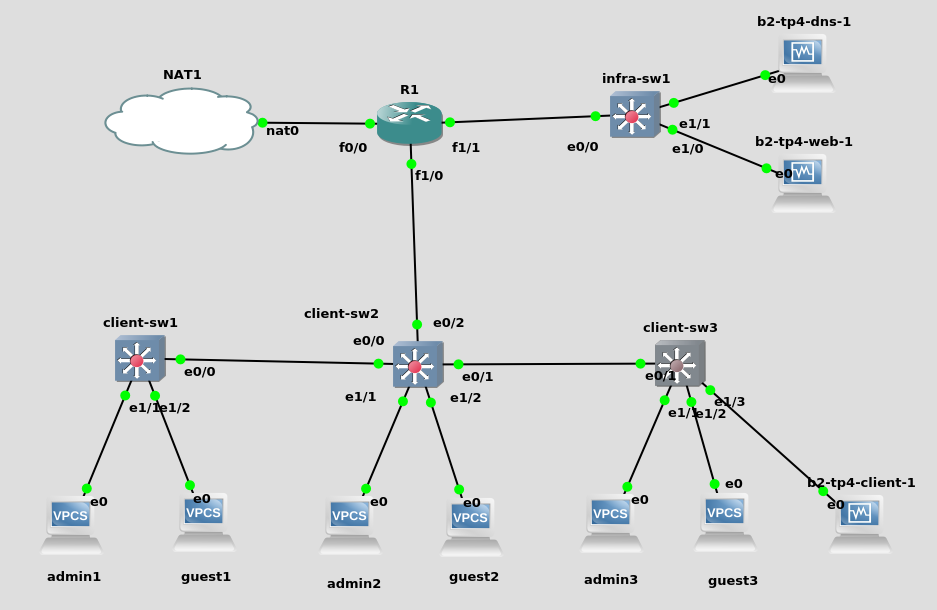
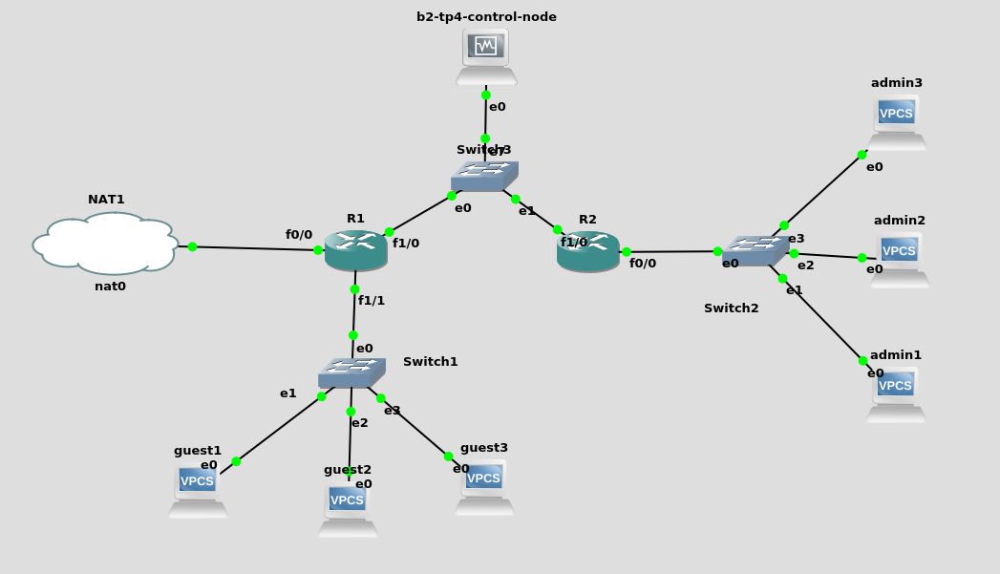

# TP4

- [Refresh](#refresh)
- [Nothing to do, ansible is here](#nothing-to-do-ansible-is-here)

## Refresh

Voilà la petite infra toute allumée sur GNS3 :

En prenant soin d'allumer les VMs à la main puisque GNS3 ajoute un port série qui casse tout

Les confs :

- [client-sw1](refresh-conf/client-sw1.conf)
- [client-sw2](refresh-conf/client-sw2.conf)
- [client-sw3](refresh-conf/client-sw3.conf)
- [infra-sw1](refresh-conf/infra-sw1.conf)
- [r1](refresh-conf/r1.conf)
- [admin1](refresh-conf/admin1.conf) (correspond à la conf de tous les admins à l'IP et le hostname près)
- [guest1](refresh-conf/guest1.conf) (correspond à la conf de tous les guest à l'IP et le hostname près)

### DNS

Sur la VM DNS :

```
sudo yum -y install bind bind-utils
# vim /etc/named.conf
# vim /var/named/tp4.b2.db
# vim /var/named/20.5.10.db
sudo firewall-cmd --add-port=53/tcp --permanent
sudo firewall-cmd --add-port=53/udp --permanent
sudo firewall-cmd --reload
sudo systemctl enable --now named
```

Les confs :

- [/etc/named.conf](refresh-conf/named.conf)
- [/var/named/tp4.b2.db](refresh-conf/tp4.b2.db)
- [/var/named/20.5.10.db](refresh-conf/20.5.10.db)

Vérification :

```
guest1> ping guest2.tp4.b2
guest2.tp4.b2 resolved to 10.5.20.12
84 bytes from 10.5.20.12 icmp_seq=1 ttl=64 time=0.783 ms
84 bytes from 10.5.20.12 icmp_seq=2 ttl=64 time=0.976 ms
84 bytes from 10.5.20.12 icmp_seq=3 ttl=64 time=0.962 ms
84 bytes from 10.5.20.12 icmp_seq=4 ttl=64 time=1.220 ms
84 bytes from 10.5.20.12 icmp_seq=5 ttl=64 time=1.143 ms

guest2> ping guest3.tp4.b2
guest3.tp4.b2 resolved to 10.5.20.13
84 bytes from 10.5.20.13 icmp_seq=1 ttl=64 time=1.304 ms
84 bytes from 10.5.20.13 icmp_seq=2 ttl=64 time=1.342 ms
84 bytes from 10.5.20.13 icmp_seq=3 ttl=64 time=1.135 ms
84 bytes from 10.5.20.13 icmp_seq=4 ttl=64 time=1.370 ms
84 bytes from 10.5.20.13 icmp_seq=5 ttl=64 time=0.835 ms

guest3> ping guest1.tp4.b2
guest1.tp4.b2 resolved to 10.5.20.11
84 bytes from 10.5.20.11 icmp_seq=1 ttl=64 time=0.845 ms
84 bytes from 10.5.20.11 icmp_seq=2 ttl=64 time=1.383 ms
84 bytes from 10.5.20.11 icmp_seq=3 ttl=64 time=1.534 ms
84 bytes from 10.5.20.11 icmp_seq=4 ttl=64 time=1.274 ms
84 bytes from 10.5.20.11 icmp_seq=5 ttl=64 time=3.391 ms
```

### Web

Sur la VM web :

```
sudo yum -y install epel-release nginx
sudo systemctl enable --now nginx
sudo firewall-cmd --add-port=80/tcp --permanent
sudo firewall-cmd --reload
```

Vérification (depuis la vm centos client) :

```
[root@localhost ~]# ip a
1: lo: [...]
2: eth0: <BROADCAST,MULTICAST,UP,LOWER_UP> mtu 1500 qdisc pfifo_fast state UP group default qlen 1000
    link/ether 08:00:27:0e:31:80 brd ff:ff:ff:ff:ff:ff
    inet 10.5.20.14/24 brd 10.5.20.255 scope global noprefixroute eth0
       valid_lft forever preferred_lft forever
    inet6 fe80::a00:27ff:fe0e:3180/64 scope link
       valid_lft forever preferred_lft forever
3: eth1: <BROADCAST,MULTICAST,UP,LOWER_UP> mtu 1500 qdisc pfifo_fast state UP group default qlen 1000
    link/ether 08:00:27:ac:50:d3 brd ff:ff:ff:ff:ff:ff
    inet 192.168.59.8/24 brd 192.168.59.255 scope global noprefixroute dynamic eth1
       valid_lft 534sec preferred_lft 534sec
    inet6 fe80::7a64:6130:eca0:77e8/64 scope link noprefixroute
       valid_lft forever preferred_lft forever

[root@localhost ~]# curl 10.5.30.12
<!DOCTYPE HTML PUBLIC "-//W3C//DTD HTML 4.01 Transitional//EN">
<html>
<head>
  <title>Welcome to CentOS</title>
  <style rel="stylesheet" type="text/css">
  [...]
  </style>

</head>

<body>

<div id="header">

    <ul class="mainlinks">
        <li> <a href="http://www.centos.org/">Home</a> </li>
        <li> <a href="http://wiki.centos.org/">Wiki</a> </li>
        <li> <a href="http://wiki.centos.org/GettingHelp/ListInfo">Mailing Lists</a></li>
        <li> <a href="http://www.centos.org/download/mirrors/">Mirror List</a></li>
        <li> <a href="http://wiki.centos.org/irc">IRC</a></li>
        <li> <a href="https://www.centos.org/forums/">Forums</a></li>
        <li> <a href="http://bugs.centos.org/">Bugs</a> </li>
        <li class="last"> <a href="http://wiki.centos.org/Donate">Donate</a></li>
    </ul>

	<div class="logo">
		<a href="http://www.centos.org/"></a>
	</div>

</div>

<div id="content">

	<h1>Welcome to CentOS</h1>

	<h2>The Community ENTerprise Operating System</h2>

	<p><a href="http://www.centos.org/">CentOS</a> is an Enterprise-class Linux Distribution derived from sources freely provided
to the public by Red Hat, Inc. for Red Hat Enterprise Linux.  CentOS conforms fully with the upstream vendors
redistribution policy and aims to be functionally compatible. (CentOS mainly changes packages to remove upstream vendor
branding and artwork.)</p>

	<p>CentOS is developed by a small but growing team of core
developers.&nbsp; In turn the core developers are supported by an active user community
including system administrators, network administrators, enterprise users, managers, core Linux contributors and Linux enthusiasts from around the world.</p>

	<p>CentOS has numerous advantages including: an active and growing user community, quickly rebuilt, tested, and QA'ed errata packages, an extensive <a href="http://www.centos.org/download/mirrors/">mirror network</a>, developers who are contactable and responsive, Special Interest Groups (<a href="http://wiki.centos.org/SpecialInterestGroup/">SIGs</a>) to add functionality to the core CentOS distribution, and multiple community support avenues including a <a href="http://wiki.centos.org/">wiki</a>, <a
href="http://wiki.centos.org/irc">IRC Chat</a>, <a href="http://wiki.centos.org/GettingHelp/ListInfo">Email Lists</a>, <a href="https://www.centos.org/forums/">Forums</a>, <a href="http://bugs.centos.org/">Bugs Database</a>, and an <a
href="http://wiki.centos.org/FAQ/">FAQ</a>.</p>

	</div>

</div>


</body>
</html>
```

---

## Nothing to do, ansible is here

_J'aurais bien aimé me pencher sur les DNS ou encore le sujet de sécu, mais j'avoue que j'avais pas trop le temps. Donc j'ai pris Ansible !_



J'ai fait une mini infra pour monter ansible rapidement dessus.

**Tableau d'adressage**

| machine        | `admin`        | `guest`        | `infra`        |
| -------------- | -------------- | -------------- | -------------- |
| `admin1`       | `10.10.10.11`  |                |                |
| `admin2`       | `10.10.10.12`  |                |                |
| `admin3`       | `10.10.10.13`  |                |                |
| `guest1`       |                | `10.10.20.11`  |                |
| `guest2`       |                | `10.10.20.12`  |                |
| `guest3`       |                | `10.10.20.13`  |                |
| `r1`           |                | `10.10.20.254` | `10.10.30.220` |
| `r2`           | `10.10.10.254` |                | `10.10.30.210` |
| `control-node` |                |                | `10.10.30.11`  |

```
[tpuser@localhost ansible]$ tree
.
├── ansible.cfg
├── backups
│   ├── show_run_10.10.30.210.txt
│   └── show_run_10.10.30.220.txt
├── handlers
│   └── router.yml
├── inventory
│   ├── group_vars
│   │   └── cisco
│   │       ├── vars.yml
│   │       └── vault.yml
│   ├── hosts.ini
│   └── host_vars
└── playbooks
    ├── r1.yml
    ├── r2.yml
    ├── router-backups.yml
    └── router.yml

7 directories, 11 files
```

Sur les deux routeurs :

```
conf t
username tpuser password tpuser
username tpuser privilege 15
ip domain-name b2
line vty 0 4
privilege level 15
password tpuser
login local
transport input ssh
exit
crypto key generate rsa
How many bits in the modulus [512]: 2048
```

Sur le control-node :

```
sudo yum -y install epel-release ansible
mkdir ansible
cd ansible
mkdir -p inventory/group_vars/cisco
# vim inventory/group_vars/cisco/vars.yml
ansible-vault create inventory/group_vars/cisco/vault.yml
# ansible-vault edit inventory/group_vars/cisco/vault.yml
mkdir inventory/host_vars
# vim inventory/hosts.ini
mkdir backups
mkdir handlers
# vim handlers/router.yml
mkdir playbooks
# vim playbooks/r1.yml
# vim playbooks/r2.yml
# vim playbooks/router-backups.yml
# vim playbooks/router.yml
```

Les confs :

- [inventory/group_vars/cisco/vars.yml](ansible/vars.yml)
- [inventory/group_vars/cisco/vault.yml (chiffré)](ansible/vault.yml)
- [inventory/hosts.ini](ansible/hosts.ini)
- [handlers/router.yml](ansible/handler-router.yml)
- [playbooks/router.yml](ansible/playbook-router.yml)
- [playbooks/r1.yml](ansible/r1.yml)
- [playbooks/r2.yml](ansible/r2.yml)
- [playbooks/router-backups.yml](ansible/router-backups.yml)

Pour run les playbooks :

```
# Déploiement de `r1` et `r2`
ansible-playbook -i inventory/hosts.ini playbooks/r1.yml playbooks/r2.yml --ask-vault-pass

# Déploiement de la conf générale
ansible-playbook -i inventory/hosts.ini playbooks/router.yml --ask-vault-pass

# Backup de la conf
ansible-playbook -i inventory/hosts.ini playbooks/router-backups.yml --ask-vault-pass

# Conf + Backup de tout
ansible-playbook -i inventory/hosts.ini playbooks/router.yml playbooks/r1.yml playbooks/r2.yml playbooks/router-backups.yml --ask-vault-pass
```

Tests :

```
# sur control-node
[tpuser@localhost ansible]$ ansible-playbook -i inventory/hosts.ini playbooks/router.yml playbooks/r1.yml playbooks/r2.yml playbooks/router-backups.yml --ask-vault-pass
Vault password:

PLAY [cisco] *******************************************************************************************************************************************************************************************************

TASK [set DNS server] **********************************************************************************************************************************************************************************************
changed: [10.10.30.210]
changed: [10.10.30.220]

PLAY RECAP *********************************************************************************************************************************************************************************************************
10.10.30.210               : ok=1    changed=1    unreachable=0    failed=0
10.10.30.220               : ok=1    changed=1    unreachable=0    failed=0


PLAY [r1] **********************************************************************************************************************************************************************************************************

TASK [conf fastEthernet0/0] ****************************************************************************************************************************************************************************************
ok: [10.10.30.220]

TASK [conf fastEthernet1/0] ****************************************************************************************************************************************************************************************
ok: [10.10.30.220]

TASK [conf fastEthernet1/1] ****************************************************************************************************************************************************************************************
ok: [10.10.30.220]

TASK [set route to admin] ******************************************************************************************************************************************************************************************
ok: [10.10.30.220]

TASK [conf access list 1] ******************************************************************************************************************************************************************************************
ok: [10.10.30.220]

PLAY RECAP *********************************************************************************************************************************************************************************************************
10.10.30.210               : ok=1    changed=1    unreachable=0    failed=0
10.10.30.220               : ok=6    changed=1    unreachable=0    failed=0


PLAY [r2] **********************************************************************************************************************************************************************************************************

TASK [conf fastEthernet0/0] ****************************************************************************************************************************************************************************************
ok: [10.10.30.210]

TASK [conf fastEthernet1/0] ****************************************************************************************************************************************************************************************
ok: [10.10.30.210]

TASK [set default route via 10.10.30.220] **************************************************************************************************************************************************************************
ok: [10.10.30.210]

TASK [set route to guests] *****************************************************************************************************************************************************************************************
ok: [10.10.30.210]

PLAY RECAP *********************************************************************************************************************************************************************************************************
10.10.30.210               : ok=5    changed=1    unreachable=0    failed=0
10.10.30.220               : ok=6    changed=1    unreachable=0    failed=0


PLAY [cisco] *******************************************************************************************************************************************************************************************************

TASK [Store running-config] ****************************************************************************************************************************************************************************************
ok: [10.10.30.210]
ok: [10.10.30.220]

TASK [Save running-config on control node] *************************************************************************************************************************************************************************
changed: [10.10.30.210]
changed: [10.10.30.220]

PLAY RECAP *********************************************************************************************************************************************************************************************************
10.10.30.210               : ok=7    changed=2    unreachable=0    failed=0
10.10.30.220               : ok=8    changed=2    unreachable=0    failed=0

# on change l'ip sur R1
conf t
interface fastEthernet 0/0
ip addr 10.5.5.3 255.255.255.0

# on relance le playbook pour r1
[tpuser@localhost ansible]$ ansible-playbook -i inventory/hosts.ini playbooks/r1.yml --ask-vault-pass
Vault password:

PLAY [r1] **********************************************************************************************************************************************************************************************************

TASK [conf fastEthernet0/0] ****************************************************************************************************************************************************************************************
changed: [10.10.30.220]

TASK [conf fastEthernet1/0] ****************************************************************************************************************************************************************************************
ok: [10.10.30.220]

TASK [conf fastEthernet1/1] ****************************************************************************************************************************************************************************************
ok: [10.10.30.220]

TASK [set route to admin] ******************************************************************************************************************************************************************************************
ok: [10.10.30.220]

TASK [conf access list 1] ******************************************************************************************************************************************************************************************
ok: [10.10.30.220]

RUNNING HANDLER [restart interface 0/0] ****************************************************************************************************************************************************************************
changed: [10.10.30.220]

PLAY RECAP *********************************************************************************************************************************************************************************************************
10.10.30.220               : ok=6    changed=2    unreachable=0    failed=0
```

Et voilààààà c'est bien idempotent !

C'est pas très long mais ça fonctionne bien

---

J'avais pas de pommes pour faire la compote, alors du coup voilà une photo d'un curry-porc tonkatsu-riz que j'ai fait :


Et deux photos de mon jardin parce que c'est joli (bon j'avoue y a des armoires en plein milieu c'est pas ouf, mais je devais déménager xD) :


Merci encore pour tes cours et pour ton énergie, à très vite pour une bière !

Bon courage et des bisous
